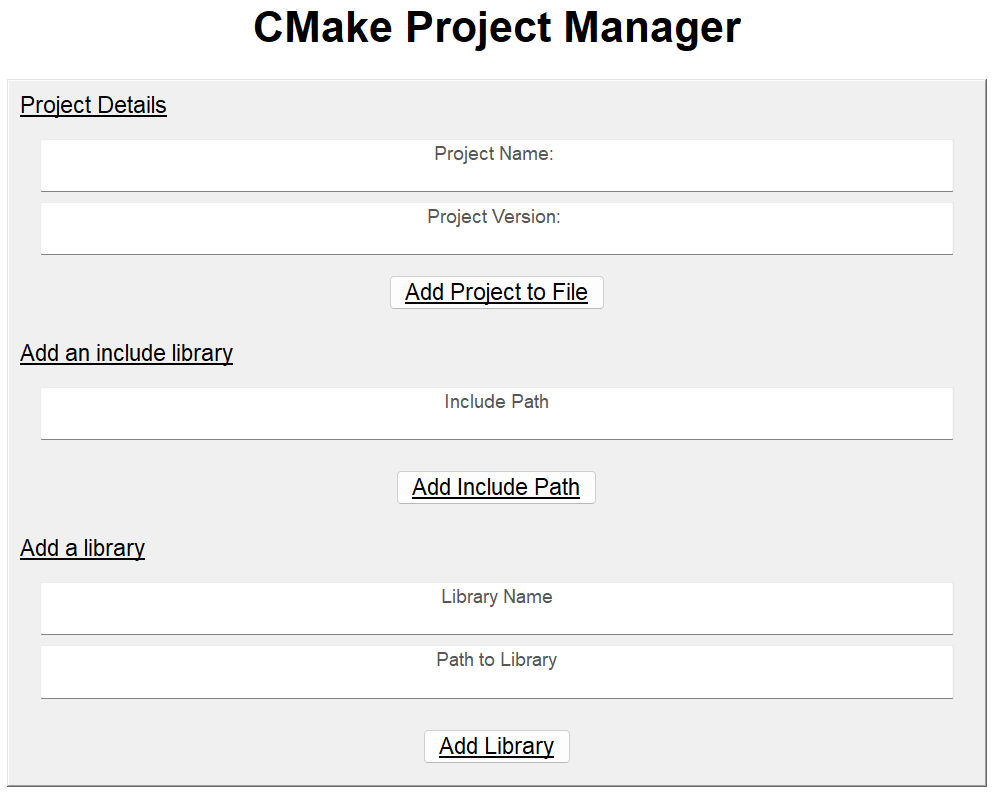

# CMakeProjectManager

A simple appliction to save your time working with CMake to configure your projects to instead get your fingers typing C++ code. This application has a scaleable GUI and is used to add all the necessary information to get your C++ project on the go.

In the future I will add the ability to see the file and it's content within the app but now it only creates the 'CMakeLists.txt' file in the background and outputs it in an output folder located where the executable is stored

Libraries I used so far:

1. wxWidgets: All the UI is built on top of wxWidgets (Check License at https://github.com/wxWidgets/wxWidgets)
2. FileManage: A simple library I wrote from scratch to manipulate files
